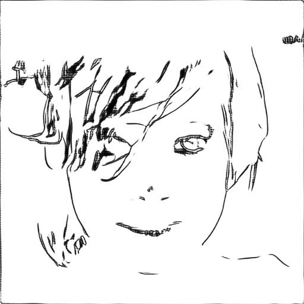
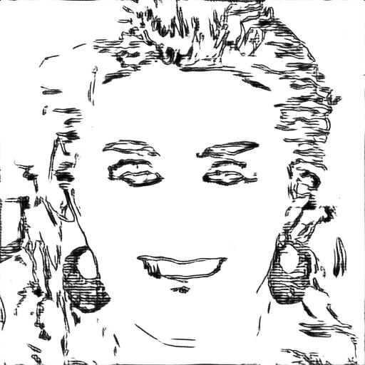
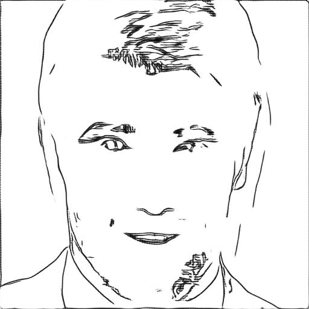
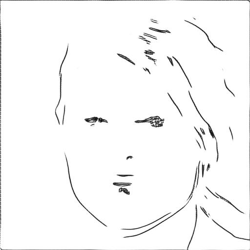
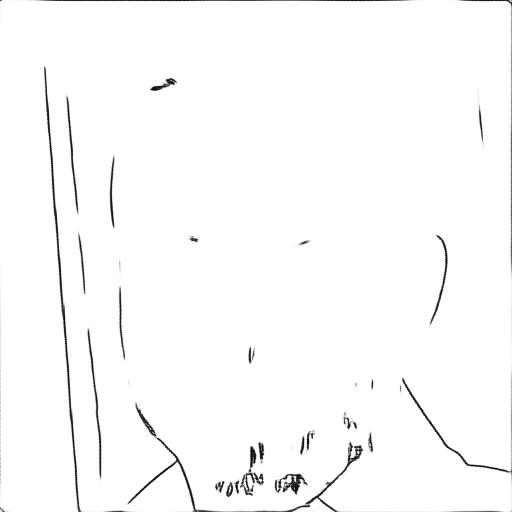
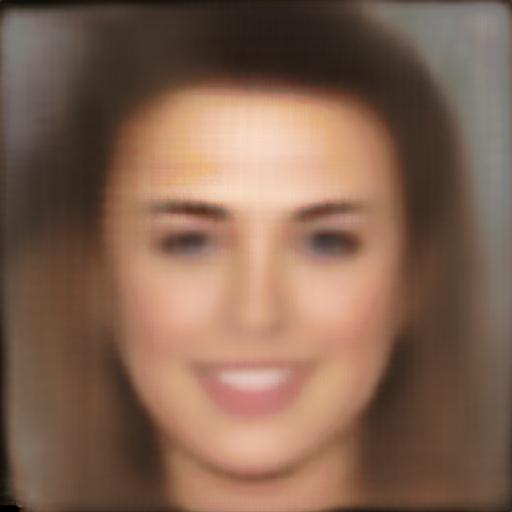
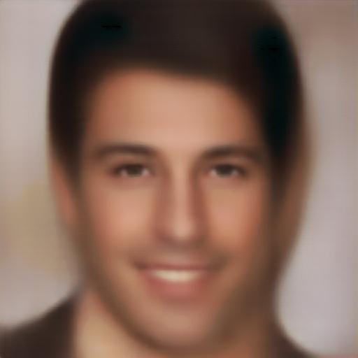
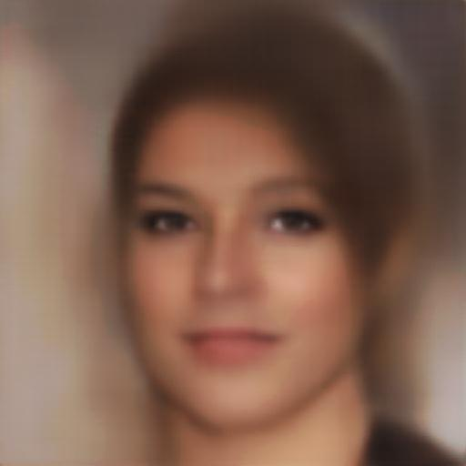
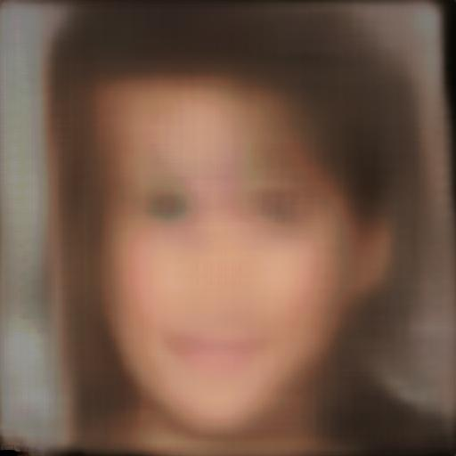

# Deep Face Drawing - Weight v1.0

This weight contains the Component Embedding module (encoder, decoder, output), Feature Mapping module (decoder, output), and Image Synthesis module (generator, discriminator D1, discriminator D2, discriminator D3). Modules are trained on stage 1 and stage 2 for 20 epochs each.
  
<table>
  <tr>
    <td></td>
    <td></td>
    <td></td>
    <td></td>
    <td></td>
  </tr>
  <tr>
    <td></td>
    <td></td>
    <td></td>
    <td></td>
    <td></td>
  </tr>
</table>

---

This project was developed as part of Nodeflux Internship x Kampus Merdeka.
